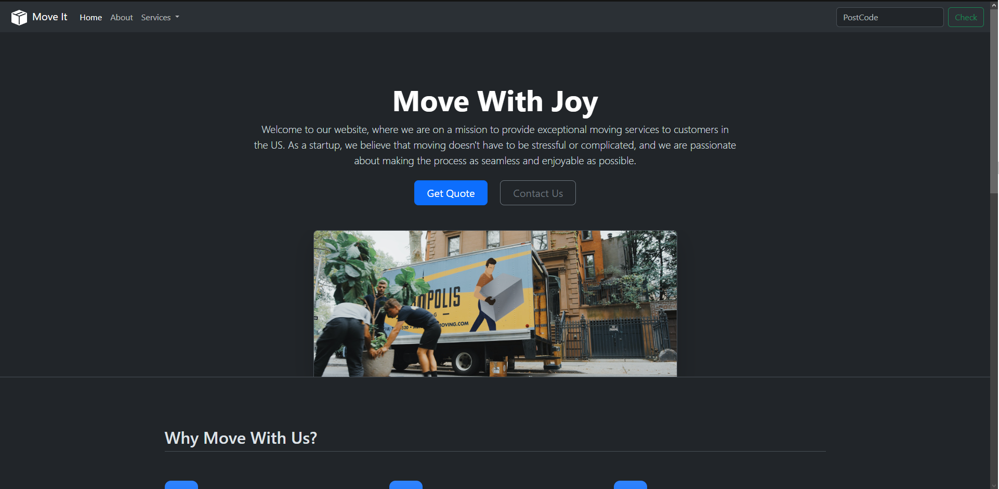

# ReactiveAgencyWebsite
Basic reactive Agency Website to practice CSS properties.

  
   ### With Higher and Lower Res
  
   

# Mondrian Paint

Mondrian paint using only CSS to practice grid properties.

    

# Mondrian Paint

MoveIt startup company website using Bootstrap. 

    
